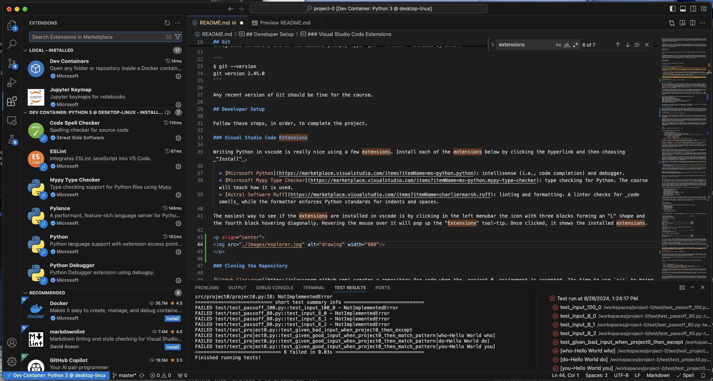
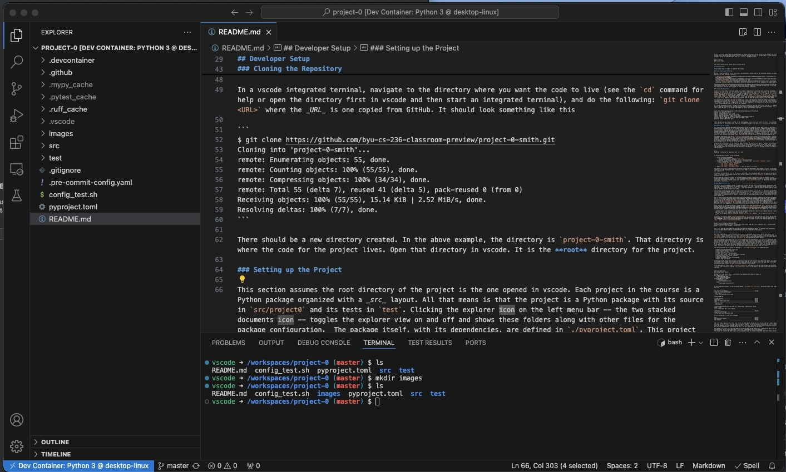
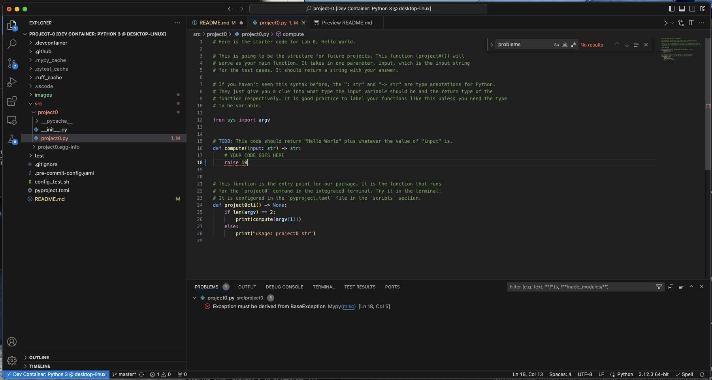
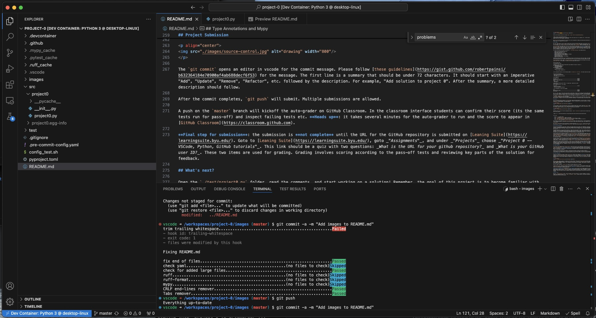
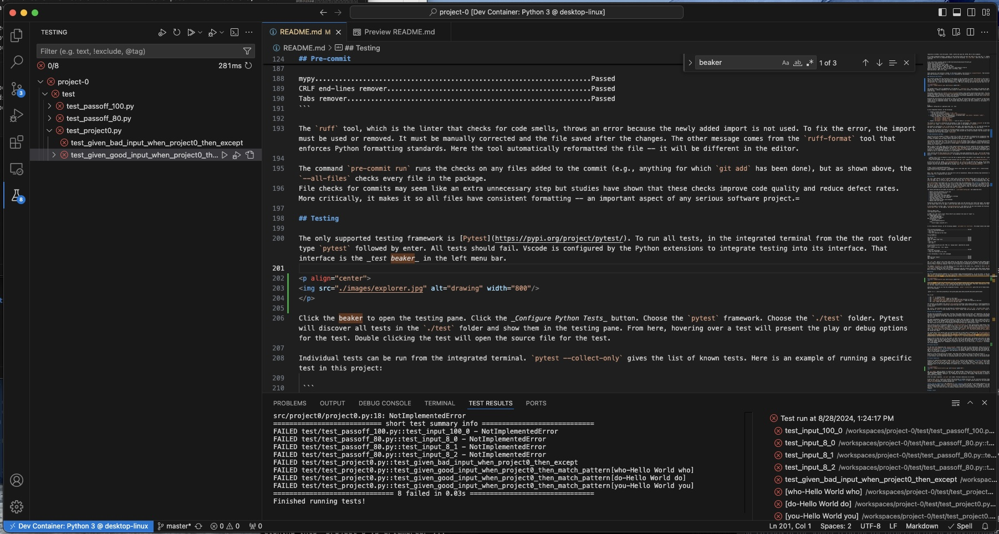
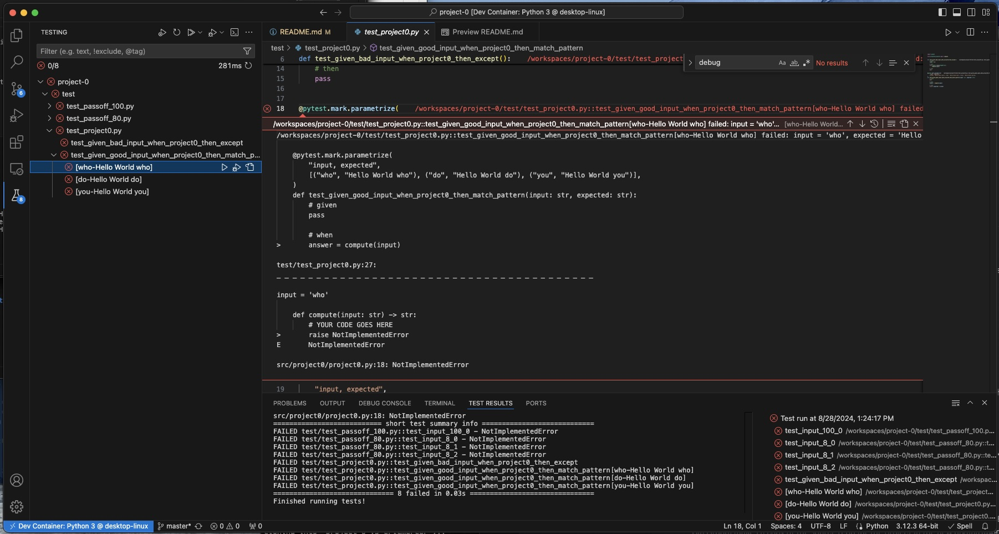
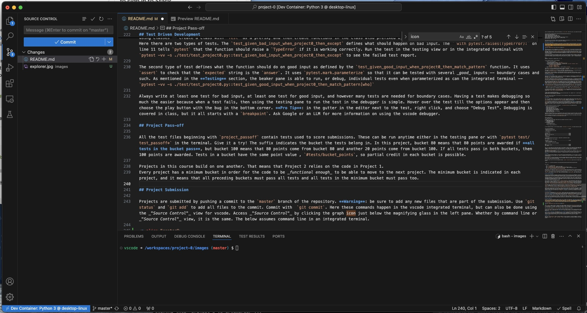

[](https://classroom.github.com/a/QkFT6ccD)
## Visual Studio Code

The only supported _integrated development environment_ (IDE) is [Visual Studio Code](https://code.visualstudio.com) (vscode). [Download and install vscode](https://code.visualstudio.com/download) if it is not already installed on the system being used. The easiest way to see if it is installed is by using the search tool for the system. Search for _"Visual Studio Code"_.

Most (all) of the instructions for the projects assume some knowledge of working on the command line in a terminal. The preferred terminal in the vscode integrated terminal. This brief review of [terminal basics in vscode](https://code.visualstudio.com/docs/terminal/basics) is a helpful review. For this project being able to open an integrated terminal is most important and is fortunately the very first part of [terminal basics in vscode](https://code.visualstudio.com/docs/terminal/basics).

## Python

CS 236 uses [Python](https://www.python.org) for all programming projects, and it must be installed on the system being used. Please follow the instructions at the  [Python Downloads](https://www.python.org/downloads/) page to install the latest version on the system being used if it is not already there. The easiest way to see if Python is installed, and what version, is to open a vscode integrated terminal, and at the command prompt, type `python --version` followed by enter:

```
$ python --version
Python 3.12.3
```

Versions 3.9 or greater should be fine for this course. Be sure Python is installed on the system before moving to the next section.

## Git

The programming projects all rely on [GitHub Classroom](https://classroom.github.com) and [Git](https://git-scm.com). [Git](https://git-scm.com) must be installed on the system to complete the lab. Please follow the instructions an [Git Downloads](https://git-scm.com/downloads) to install the latest version of Git on the system if it is not already there. The easiest way to see if Git is installed, and what version, is to open again a vscode integrated terminal, and at the command prompt, type `git --version` followed by enter:

```
$ git --version
git version 2.45.0
```

Any recent version of Git should be fine for the course.

## Developer Setup

Follow these steps, in order, to complete the project.

### Visual Studio Code Extensions

Writing Python in vscode is really nice using a few extensions. Install each of the extensions below by clicking the hyperlink and then choosing _"Install"_.

  * [Microsoft Python](https://marketplace.visualstudio.com/items?itemName=ms-python.python): intellisense (i.e., code completion) and debugger.
  * [Microsoft Mypy Type Checker](https://marketplace.visualstudio.com/items?itemName=ms-python.mypy-type-checker): type checking for Python. The course will teach how it is used.
  * [Astral Software Ruff](https://marketplace.visualstudio.com/items?itemName=charliermarsh.ruff): linting and formatting. A linter checks for _code smells_ while the formatter enforces Python standards for indents and spaces.

The easiest way to see if the extensions are installed in vscode is by clicking in the left menubar the icon with three blocks forming an "L" shape and the fourth block hovering diagonally. Hovering the mouse over it will pop up the "Extensions" tool-tip. Once clicked, it shows the installed extensions.

<p align="center">

</p>

### Cloning the Repository

[GitHub Classroom](https://classroom.github.com) creates a repository for code when the _project 0_ assignment is accepted. Its time to use `git` to bring that code to the system being used to code a solution. The [git tutorial](https://git-scm.com/docs/gittutorial) is a good starting point for learning `git` but not required for the course. Working knowledge of the following `git` commands is required though: `git clone`, `git status`, `git add`, `git commit`, and `git push`. Other helpful commands include: `git branch`, `git checkout`, and `git merge`. Learn about these online or from `git` directly using the `--help` flag. For example, in the vscode integrated terminal, try `git clone --help`. Here it described what the command does and what the various options are for the command.

For this step of the project, all that is needed in to _clone_ the repository created by GitHub Classroom when the assignment was accepted. Goto [GitHub Classroom](https://classroom.github.com) and log into the system. Navigate to the "Project 0" and click the _"Repository"_ link. The link should go to the repository on GitHub. Click the green _"Code"_ button and copy the _HTTPS_ URL to the clipboard.

In a vscode integrated terminal, navigate to the directory where you want the code to live (see the `cd` command for help or open the directory first in vscode and then start an integrated terminal), and do the following: `git clone <URL>` where the _URL_ is one copied from GitHub. It should look something like this

```
$ git clone https://github.com/byu-cs-236-classroom-preview/project-0-smith.git
Cloning into 'project-0-smith'...
remote: Enumerating objects: 55, done.
remote: Counting objects: 100% (55/55), done.
remote: Compressing objects: 100% (34/34), done.
remote: Total 55 (delta 7), reused 41 (delta 5), pack-reused 0 (from 0)
Receiving objects: 100% (55/55), 15.14 KiB | 2.52 MiB/s, done.
Resolving deltas: 100% (7/7), done.
```

There should be a new directory created. In the above example, the directory is `project-0-smith`. That directory is where the code for the project lives. Open that directory in vscode. It is the **root** directory for the project.

### Setting up the Project

This section assumes the root directory of the project is the one opened in vscode. Each project in the course is a Python package organized with a _src_ layout. All that means is that the project is a Python package with its source in `src/project0` and its tests in `test`. Clicking the explorer icon on the left menu bar -- the two stacked documents icon -- toggles the explorer view on and off and shows these folders along with other files for the package configuration. The screen shot shows the explorer view. The icon is the top one with the blue bar next to it to indicate that it is the active view.

<p align="center">

</p>

The package itself, with its dependencies, are defined in `./pyproject.toml`. This project file should not need to be edited except to add new package dependencies -- adding a dependency for this project or others is very unlikely to be needed. Other files that come with the project will be explained along the way.

Development takes place in a [Python virtual environment](https://docs.python.org/3/library/venv.html). The only supported virtual environment is venv. A virtual environment isolates this project from anything else installed on a system so that there are no conflicts between system level and package level dependencies. The instructions to setup a venv and install the project dependencies are below (see [vscode python tutorial](https://code.visualstudio.com/docs/languages/python) for more on virtual environments).

Assuming the root directory of the project is open in vscode, the instructions require a terminal in that directory. We will us the integrated terminal in vscode. To get an integrated terminal, on the vscode menu choose _"View"_ and then _"Terminal"_. This menu option should open a window on the bottom of vscode that is an integrated terminal. That terminal should be sitting at the root directory of the project -- type `ls` followed by enter. It should look like the below:

```
$ ls
README.md  config_test.sh  pyproject.toml  src  test
```

In the integrated terminal, do the following:

  1. Create a virtual environment
      * In the root directory: `python3 -m venv .venv`
      * Activate the virtual environment: `source .venv/bin/activate`
  1. Install the package, with `dev` dependencies, in editable mode: `pip install --editable ".[dev]"`.
      * Only if above fails with missing packages:
          * `pip install --upgrade setuptools`
          * `pip install --upgrade build`
          * `pip install --editable ".[dev]"`
  1. Enable `pre-commit`: `pre-commit install` -- more to come on `pre-commit`.

The project is now fully configured and everything is ready for development. The command `project0` on the terminal should print usage information (see `./pyproject.toml` under `scripts` to discover the entry point in the package for `project0`).

The project is installed by `pip` in the venv in _edit mode_. Edit mode means that `pip` is using the actual project files.  To uninstall the package from the venv, use the command `pip uninstall project0` -- should never need to uninstall for this course.

Be sure that the virtual environment is activated whenever working in the project from the terminal. In the integrated vscode terminal, there is a `.venv` preceding the terminal prompt. If that is not there, then activate the virtual environment from the project root directory: `source .venv/bin/activate`. To deactivate the virtual environment: `deactivate`.

## Type Annotations and Mypy

Type errors are not uncommon in Python. A type error is where the code gets an unexpected and incompatible type for the given statement or expression. For example, returning a `str` from a function that should return an `int` is a type error, as is assigning an `int` to a `str`.  Type error defects are easy to create in Python code and always seem to manifest at the absolute worst times.

[Mypy](https://mypy-lang.org) checks for type errors in all the Python files in the `src` directory and any Python file or directory with Python files that does not start with `test`. It relies on [type annotations](https://mypy.readthedocs.io/en/stable/builtin_types.html) in the Python code for the checks. On the surface, type annotations in Python appear to undermine some of Python's niceness, but the annotations greatly aid with maintaining, or working with, Python code.

Mypy is able to infer many types, but it does require annotations on function signatures and variable assignments when it is not able to infer the type in the assignment. The package dependencies include the `mypy` executable, so it can be run on the command line: `mypy --strict <file>`. The `--strict` flag is how it is configured in the project. The [Microsoft Mypy Type Checker](https://marketplace.visualstudio.com/items?itemName=ms-python.mypy-type-checker) extension (in the recommended list so it is already installed) will flag Mypy errors in red in the editor and offer suggestions. Pre-commit can be run anytime as well to check the annotations (or lack thereof).

Class lectures and TA help sessions will teach more about using type annotations and `mypy`, but try the following example to get started. Use the vscode Explorer to open `/src/project0/project0.py`. by navigating to the directory and clicking the `project0.py` file. That opens it in a editor tab. **Pro hints**

  * Double click a file in Explorer to pin the tab so opening another file doesn't just replace this one -- pinned tabs show the file in regular rather than italicized font.
  * Files can be opened from the integrated terminal with the `code` command: `code src/project0/project0.py`. Try it!!

In the file on line 18, change `raise NotImplementedError` to `return 10` and save the file. First, the 10 should be underlined in a red squiggle. Hovering the mouse over the squiggle gives the type error and the same message is in the _"PROBLEMS"_ pain in the bottom window where the terminal is located.

<p align="center">

</p>

Click on the terminal pane and try running `mypy`: `mypy --strict src/project0/project0.py`

```
$ mypy --strict src/project0/project0.py
src/project0/project0.py:18: error: Incompatible return value type (got "int", expected "str")  [return-value]
Found 1 error in 1 file (checked 1 source file)
```

Here `mypy` give the line number for the type error with an explanation. Adding and checking type annotations results in fewer defects and more readable Python code. It is required in this course.

## Pre-commit

The `mypy` type checker is one of several useful tools to help write better Python code in this course. The `pre-commit` tool is another. The `pre-commit` tool runs when `git` is used to `commit` a new code revision. The `git commit` command is discussed later. The `pre-commit` tool is discussed here because it is so useful that is is nice to be able to run it not just with `git commit` but while developing code in general.

[Pre-commit](https://pre-commit.com) is a tool to check files and automatically runs **before** committing them to the Git repository. When it runs as part of `git commit` then every file that is part of the commit are run through a series of code checks. If all the files that are part of the commit pass the checks, then the commit goes through. If any file fails any check, then the issues are reported on the terminal and the commit is rejected. The files need to be updated to resolve the issues and re-added to the commit in order for the commit to go through. What is nice about `pre-commit` is that it can be run at anytime to check files and not just with `git commit`.

The checks performed by pre-commit are defined in `./.pre-commit-config.yaml` and summarized here:

  * Remove trailing whitespace on any line
  * Force files to end on a newline
  * Format check yaml files
  * Prevent large files from being added
  * Static check Python files for code smells (linting)
  * Reformat Python files to PEP standards
  * Type check Python files
  * Convert everything to Unix line encodings
  * Replace tabs with spaces

Formatting related checks that fail are automatically fixed, but the failures still abort the commit. Any updated file needs to be re-added to the commit and the commit needs to be run again. Linter and type check errors must be manually corrected. Details for each failure are reported in the terminal.

To see pre-commit in action, open `src/project0/project0.py` and remove all the new lines between the functions `project0` and `project0cli` and add `from typing import Tuple` to the imports. The code in the file should look like this

```
from sys import argv
from typing import Tuple

# FIXME: This code should return "Hello World" plus whatever the value of "input" is.
def compute(input: str) -> str:
    # YOUR CODE GOES HERE
    raise NotImplementedError
def project0cli() -> None:
    if len(argv) == 2:
        print(compute(argv[1]))
    else:
        print("usage: project0 str")
```

In the integrated terminal, do the following command: `pre-commit run --all-files`. The output should look something like this

```
trim trailing whitespace.................................................Failed
- hook id: trailing-whitespace
- exit code: 1
- files were modified by this hook

Fixing README.md

fix end of files.........................................................Passed
check yaml...............................................................Passed
check for added large files..............................................Passed
ruff.....................................................................Failed
- hook id: ruff
- exit code: 1

src/project0/project0.py:13:20: F401 [*] `typing.Tuple` imported but unused
Found 1 error.
[*] 1 fixable with the `--fix` option.

ruff-format..............................................................Failed
- hook id: ruff-format
- files were modified by this hook

1 file reformatted, 5 files left unchanged

mypy.....................................................................Passed
CRLF end-lines remover...................................................Passed
Tabs remover.............................................................Passed
```

The `ruff` tool, which is the linter that checks for code smells, throws an error because the newly added import is not used. To fix the error, the import must be used or removed. It must be manually corrected and the file saved after the changes. The other message comes from the `ruff-format` tool that enforces Python formatting standards. Here the tool automatically reformatted the file -- it will be different in the editor.

The command `pre-commit run` runs the checks on any files added to the commit (e.g., anything for which `git add` has been done), but as shown above, the `--all-files` checks every file in the package.
File checks for commits may seem like an extra unnecessary step but studies have shown that these checks improve code quality and reduce defect rates. More critically, it makes it so all files have consistent formatting -- an important aspect of any serious software project. Here is a screen shot with it in the integrated terminal.

<p align="center">

</p>

## Testing

The only supported testing framework is [Pytest](https://pypi.org/project/pytest/). To run all tests, in the integrated terminal from the the root folder type `pytest` followed by enter. All tests should fail. Vscode is configured by the Python extensions to integrate testing into its interface. That interface is the _test beaker_ in the left menu bar.

<p align="center">

</p>

Click the beaker to open the testing pane. Click the _Configure Python Tests_ button. Choose the `pytest` framework. Choose the `./test` folder. Pytest will discover all tests in the `./test` folder and show them in the testing pane. From here, hovering over a test will present the play or debug options for the test. Double clicking the test will open the source file for the test.

<p align="center">

</p>

Individual tests can be run from the integrated terminal. `pytest --collect-only` gives the list of known tests. Here is an example of running a specific test in this project:

 ```
 pytest -vv -s ./test/test_project0.py::test_given_good_input_when_project0_then_match_pattern[who]
 ```

Try it out!

  * the `-vv` is verbose output
  * the `-s` includes any `print` output in the report
  * the `./test/test_project0.py` names the file where the test function is found
  * the `::test_given_good_input_when_project0_then_match_pattern` names the function in the file
  * the `[who]` names the parameter to use for the test input.

The function in the example uses [@pytest.mark.parameterize](https://docs.pytest.org/en/7.1.x/how-to/parametrize.html) to list several inputs for the test to use. Parameterization is a great way to give the same test code several different inputs, and students are encouraged to use parameterization when writing tests.

The `pytest` tool discovers test by searching for anything prefixed by `test` or `Test`. To write a test, write a function with the `test` prefix in its name and add an `assert` to that function. If the `assert` holds, then the test passes. If the `assert` fails, then the test fails.

## Test Driven Development

The best way do developed is with tests. Writing a test helps figure out the input, the computation, and the expected output. It also helps break seemingly overwhelming programming tasks into small manageable pieces defined by tests. _Test driven development_ (TDD) is the process of first writing a test for a new behavior in the code, running the test to see it fail (for whatever reason including missing definitions), and then writing code to make the test pass.

TDD makes programming a nicer experience because it signals when the program is done, and it signals when the program is not working. It also provides immediate access to the debugger with failing input using the testing pane in vscode. Learning to write tests first and then code is an important part of the course.  It is also key to completing the programming projects in a timely manner. Write a test. See the test fail. Write the code. See the test pass. TDD helps tackle one small part of the program at a time with each part starting with a test.

Tests written as part of development belong in `test/test_project0.py` or other appropriately named Python files in the `test` folder. These can be logically grouped using classes -- create a class with `Test` as a prefix, and then create functions in the class also prefixed by `test`. Open the `/src/test/test_project0.py` folder. Here there are two types of tests. The `test_given_bad_input_when_project0_then_except` defines what should happen on bad input. The ` with pytest.raises(TypeError):` on line 11 tells `pytest` that the function should raise a `TypeError` if it is working correctly. Run the test in the testing view or in the integrated terminal with `pytest -vv -s ./test/test_project0.py::test_given_bad_input_when_project0_then_except` to see the failed test report.

The second type of test defines what the function should do on good input as defined by the `test_given_good_input_when_project0_then_match_pattern` function. It uses `assert` to check that the `expected` string is the `answer`. It uses `pytest.mark.parameterize` so that it can be tested with several _good_ inputs -- boundary cases and such. As mentioned in the **Testing** section, the beaker pane is able to run, or debug, individual tests even when parameterized as can the integrated terminal -- `pytest -vv -s ./test/test_project0.py::test_given_good_input_when_project0_then_match_pattern[who]`

Always write at least one test for bad input, at least one test for good input, and however many tests are needed for boundary cases. Having a test makes debugging so much the easier because when a test fails, then using the testing pane to run the test in the debugger is simple. Hover over the test till the options appear and then choose the play button with the bug in the bottom corner. **Pro Tip**: in the gutter in the editor next to the test, right click, and choose "Debug Test". Debugging is covered in class, but it all starts with a `breakpoint`. Ask Google or an LLM for more information on using the vscode debugger.

## Project Pass-off

All the test files beginning with `project_passoff` contain tests used to score submissions. These can be run anytime either in the testing pane or with `pytest test/test_passoff*` in the terminal. Give it a try! The suffix indicates the bucket the tests belong in. In this project, bucket 80 means that 80 points are awarded if **all tests in the bucket pass**, but bucket 100 means that 80 points come from bucket 80 and another 20 points come from bucket 100. If all tests pass in both buckets, then 100 points are awarded. Tests in a bucket have the same point value , `#tests/bucket_points`, so partial credit in each bucket is possible.

Projects in this course build on one another. That means that Project 2 relies on the code in Project 1.
Every project has a minimum bucket in order for the code to be _functional enough_ to be able to move to the next project. The minimum bucket is indicated in each project, and it means that all preceding buckets must pass all tests and all tests in the minimum bucket must pass too.

## Project Submission

Projects are submitted by pushing a commit to the `master` branch of the repository. **Warning**: be sure to add any new files that are part of the submission. Use `git status` and `git add` to add all files to the commit. Commit with  `git commit`. Here these commands happen in the vscode integrated terminal, but can also be done using the _"Source Control"_ view for vscode. Access _"Source Control"_ by clicking the graph icon just below the magnifying glass in the left pane. Whether by command line or _"Source Control"_ view, it is the same. The below assumes command line in an integrated terminal.

<p align="center">

</p>

The `git commit` opens an editor in vscode for the commit message. Please follow [these guidelines](https://gist.github.com/robertpainsi/b632364184e70900af4ab688decf6f53) for the message. The first line is a summary that should be under 72 characters. It should start with an imperative "Add", "Update", "Remove", "Refactor", etc. followed by the description. For example, "Add solution to project 0". After the summary, a more detailed description should follow.

After the commit completes, `git push` will submit. Multiple submissions are allowed.

A push on the `master` branch will kickoff the auto-grader on GitHub Classroom. In the classroom interface students can confirm their score (its the same tests run for pass-off) and inspect failing tests etc. **Heads up**: it takes several minutes for the auto-grader to run and the score to appear in [GitHub Classroom](https://classroom.github.com).

**Final step for submission**: the submission is **not complete** until the URL for the GitHub repository is submitted on [Leaning Suite](https://learningsuite.byu.edu/). Goto to [Leaning Suite](https://learningsuite.byu.edu/), goto _"Assignments"_, and under _"Projects"_ choose _"Project 0 -- VSCode, Python, GitHub tutorials"_. This link should be a quiz with two questions: _What is the URL for your github repository?_ and _What is your GitHub user ID?_. These two items are used for grading. Grading involves scoring according to the pass-off tests and reviewing key parts of the solution for feedback.

## What's next?

Open the `./src/project0/project0.py` folder, read the comments, and start working on a solution! Remember, the goal of this project is to become familiar with vscode, the integrated terminal, `git`, `mypy`, `pre-commit`, `pytest`, project pass-off, and project submission. Only spend enough time on it to be comfortable with the tools and process.
